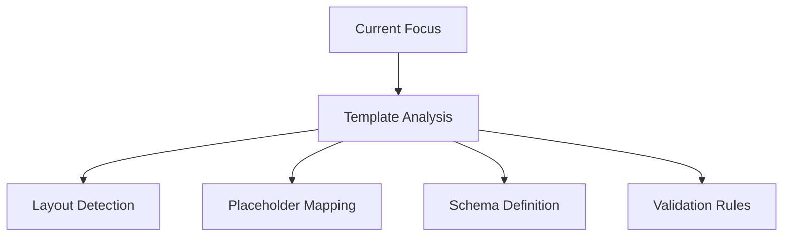

# Active Context

## Current Work Focus
Implementing the three-component architecture for markdown-to-PPTX conversion with clear data contracts and robust error handling.

### Current Implementation Phase
Component 1: Template Analysis (analyzer.py)
- Layout detection framework
- Placeholder mapping system
- layouts.json generation
- Schema validation



## Component Architecture

### 1. Template Analysis (analyzer.py)
```python
# Current implementation focus
def analyze_template(template_path: str) -> Dict[str, Any]:
    """
    Analyze PPTX template and generate layouts.json
    """
    # 1. Load template
    # 2. Extract layouts
    # 3. Map placeholders
    # 4. Generate schema
    # 5. Validate output
```

### 2. Content Processing (processor.py)
```python
# Next phase
def process_content(markdown_path: str, layouts_path: str) -> Dict[str, Any]:
    """
    Process markdown and generate presentation.json
    """
    # 1. Parse markdown
    # 2. Analyze with LLM (OpenRouter, model: deepseek/deepseek-chat-v3-0324:free)
    # 3. Select layouts
    # 4. Generate structure
    # 5. Validate output
```

### 3. Presentation Generation (generator.py)
```python
# Final phase
def generate_presentation(template_path: str, content_path: str) -> str:
    """
    Generate final PPTX presentation
    """
    # 1. Load template
    # 2. Parse content
    # 3. Create slides
    # 4. Populate content
    # 5. Save output
```

## Recent Changes
1. **Architecture Updates**
   - Defined three-component system
   - Specified data contracts
   - Documented error handling
   - Updated dependencies

2. **Documentation**
   - Updated project brief
   - Enhanced system patterns
   - Revised technical context
   - Refreshed progress tracking

3. **Implementation Planning**
   - Created component specifications
   - Defined interfaces
   - Established validation rules
   - Outlined testing strategy

## Active Decisions

### 1. Data Contracts
- Using JSON for component communication
- Strict schema validation
- Clear error messages
- Fallback mechanisms

### 2. Error Handling
- Comprehensive validation
- Graceful degradation
- Clear feedback
- Recovery options

### 3. Testing Strategy
- Unit tests per component
- Integration tests for workflow
- Performance benchmarks
- Error case coverage

## Current Considerations

### 1. Implementation Priority
- Template analyzer first
- Content processor second
- Presentation generator third
- Documentation ongoing

### 2. Technical Challenges
- Layout detection accuracy
- LLM integration stability (OpenRouter, model: deepseek/deepseek-chat-v3-0324:free)
- Error recovery strategies
- Performance optimization

### 3. Quality Assurance
- Test coverage targets
- Error handling review
- Performance metrics
- Documentation quality

## Immediate Next Steps

### 1. Template Analysis Implementation
1. Set up analyzer.py structure
2. Implement PPTX parsing
3. Create layout detection
4. Build placeholder mapping
5. Add schema validation
6. Write unit tests

### 2. Documentation Updates
1. Create analyzer.py API docs
2. Update CLI documentation
3. Add usage examples
4. Document error codes

### 3. Testing Setup
1. Create test templates
2. Write test cases
3. Set up CI pipeline
4. Add test documentation

## Open Questions
1. **Layout Detection**
   - Best method for semantic type inference
   - Handling ambiguous layouts
   - Validation criteria
   - Error thresholds

2. **Error Handling**
   - Recovery strategies
   - Fallback options
   - User notification
   - Logging approach

3. **Testing**
   - Coverage requirements
   - Performance benchmarks
   - Integration scenarios
   - Error simulations

## Blockers
None currently. Initial phase focused on analyzer.py implementation with clear specifications and requirements.

## Next Review Points
1. Template analyzer completion
2. layouts.json schema validation
3. Initial test coverage
4. Documentation review
