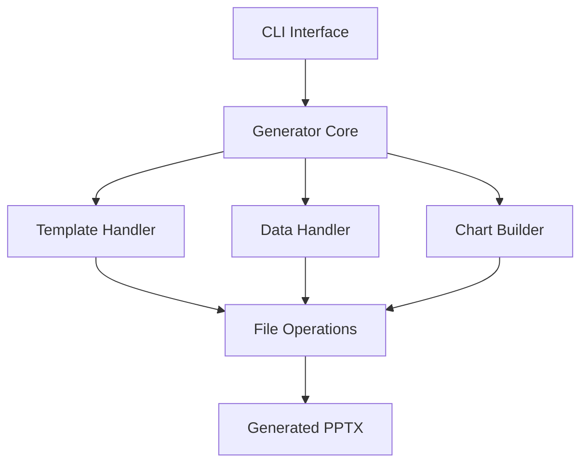

# System Patterns

## Architecture Overview

## Component Relationships

### 1. CLI Interface (main.py)
- Handles command-line arguments and user interaction
- Validates input parameters
- Orchestrates the generation process
- Provides progress feedback and error messages

### 2. Generator Core (generator.py)
- Coordinates between components
- Manages the presentation generation workflow
- Handles template and content synchronization
- Validates data against template structure

### 3. Template Handler
- Loads and parses PowerPoint templates
- Identifies placeholder locations and types
- Manages slide layouts and master slides
- Ensures template integrity

### 4. Data Handler
- Parses JSON input data
- Validates data structure
- Maps data to template placeholders
- Handles data type conversions

### 5. Chart Builder
- Creates charts from structured data
- Handles different chart types
- Manages chart styling and formatting
- Integrates charts into slides

### 6. File Operations
- Manages file I/O operations
- Handles path resolution
- Implements error handling for file operations
- Manages temporary files and cleanup

## Design Patterns

1. **Factory Pattern**
   - Used for creating different types of content handlers
   - Supports extensibility for new content types

2. **Strategy Pattern**
   - Applied to chart generation
   - Allows for different chart creation strategies

3. **Template Method Pattern**
   - Used in the core generator workflow
   - Defines skeleton of operations

4. **Facade Pattern**
   - Simplifies complex operations behind CLI
   - Provides unified interface to subsystems

## Error Handling Strategy
- Comprehensive error messages
- Graceful failure handling
- User-friendly error reporting
- Recovery mechanisms where possible

## Performance Considerations
- Efficient template parsing
- Optimized file operations
- Memory management for large presentations
- Progress tracking for long operations
