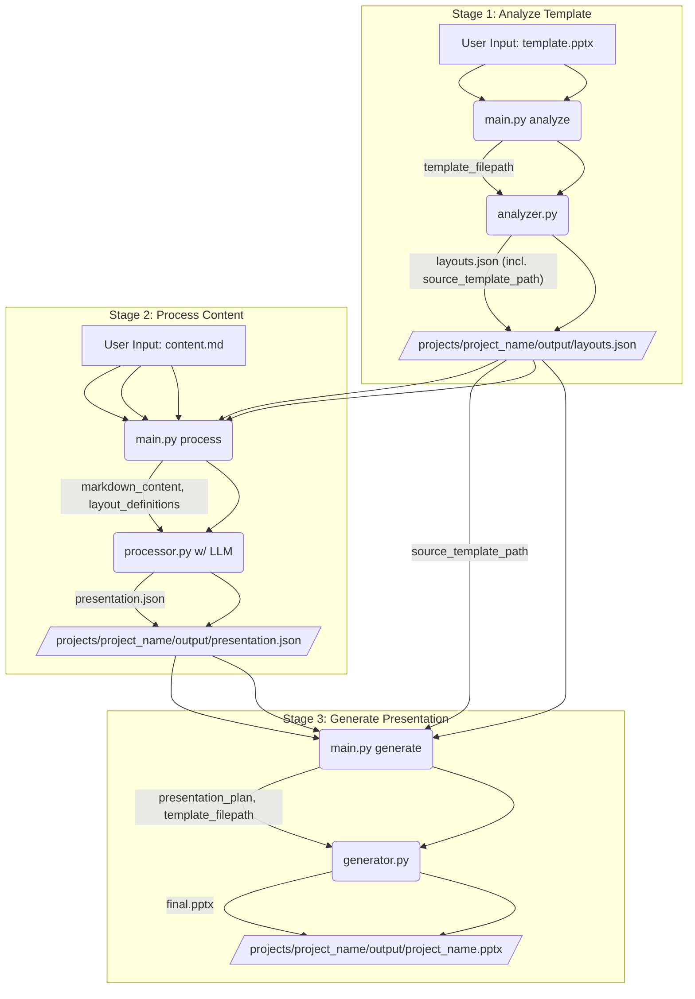

# System Patterns

## Architecture Overview & Data Flow
The system follows a three-stage CLI-driven process: `analyze`, `process`, and `generate`.



## Component Specifications

### 1. Template Analyzer (`analyzer.py`)
- **Purpose:** Extract template layout information and store the source template path.
- **Input:** Path to a PPTX template file.
- **Output:** `layouts.json` file containing:
    - `source_template_path`: Path to the input PPTX template.
    - `layouts`: A list of available layouts, each with a `name` and a list of `placeholders` (names).
- **Key Logic:** Uses `python-pptx` to inspect slide masters and layouts.

### 2. Content Processor (`processor.py`)
- **Purpose:** Convert markdown content into a structured presentation plan using LLM, guided by available layouts.
- **Input:**
    - Path to `content.md`.
    - Path to `layouts.json` (to provide layout definitions to the LLM).
- **Output:** `presentation.json` file containing:
    - `slides`: A list of slide definitions, each with a `layout` (name) and a `placeholders` dictionary mapping placeholder names to content (string or list of strings).
- **Key Logic:**
    - Sends markdown and layout information to an LLM (OpenRouter, model: `deepseek/deepseek-chat-v3-0324:free` via `openai` library).
    - Parses LLM response (JSON), using `ast.literal_eval` for stringified lists.
    - Includes a fallback parser for basic content structuring if LLM fails.

### 3. Presentation Generator (`generator.py`)
- **Purpose:** Create the final PPTX presentation by populating a template with content from the presentation plan.
- **Input:**
    - Path to `presentation.json`.
    - Path to the source PPTX template file.
- **Output:** Final `.pptx` file.
- **Key Logic:**
    - Uses `python-pptx` to add slides based on layout names from `presentation.json`.
    - Populates placeholders on each slide by matching names from the `placeholders` dictionary in `presentation.json` to `shape.name`.
    - Handles text and list-of-text content. Basic image handling (uses string as alt-text if image file not found).

## Data Contracts

### 1. `layouts.json`
**Purpose:** Define available template layouts, placeholders, and the source template path.
```json
{
  "source_template_path": "templates/default_template.pptx",
  "layouts": [
    {
      "name": "Title Slide",
      "placeholders": [
        "Title 1",
        "Subtitle 2"
      ]
    },
    {
      "name": "Title and Content",
      "placeholders": [
        "Title 1",
        "Content Placeholder 2"
      ]
    }
    // ... more layouts
  ]
}
```

### 2. `presentation.json`
**Purpose:** Define presentation content and structure, mapping content to specific placeholders in chosen layouts.
```json
{
  "slides": [
    {
      "layout": "Title Slide",
      "placeholders": {
        "Title 1": "The Future of AI",
        "Subtitle 2": "A Presentation by Jane Doe"
      }
    },
    {
      "layout": "Title and Content",
      "placeholders": {
        "Title 1": "Key Developments",
        "Content Placeholder 2": [
            "Rise of Transformers",
            "Open Source Models",
            "Multimodal Capabilities"
        ]
      }
    }
    // ... more slides
  ]
}
```
*Note: The key for the content map per slide is `placeholders`.*

## Design Patterns
- **CLI Facade (`main.py`):** Simplifies user interaction with the three-stage process.
- **Strategy Pattern (in `processor.py`):** LLM-based processing as primary, with a rule-based fallback.
- **Data-Driven Configuration:** `layouts.json` and `presentation.json` drive the generation process.

## Error Handling Strategy
- Input validation at each stage (file existence, basic format checks).
- `try-except` blocks for file I/O and LLM communication.
- Fallback parser in `processor.py` if LLM fails or returns malformed data.
- Logging for warnings and errors.
