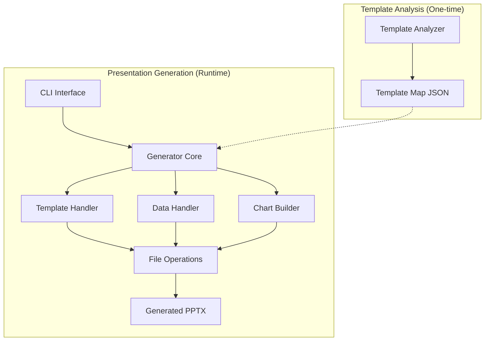

# System Patterns

## Architecture Overview

## Component Relationships

### 1. Template Analyzer (template_analyzer.py)
- Analyzes PowerPoint template structure
- Identifies layouts and their semantic types
- Maps placeholders and their properties
- Generates template_map.json configuration

### 2. CLI Interface (main.py)
- Provides analyze and generate subcommands
- Handles command-line arguments and user interaction
- Validates input parameters and paths
- Orchestrates analysis and generation processes
- Provides progress feedback and error messages

### 3. Generator Core (generator.py)
- Uses template_map.json for layout decisions
- Coordinates between components
- Manages the presentation generation workflow
- Maps semantic content types to layouts
- Validates data against template structure

### 4. Template Handler
- Loads and parses PowerPoint templates
- Identifies placeholder locations and types
- Manages slide layouts and master slides
- Ensures template integrity

### 5. Data Handler
- Parses JSON input data
- Validates data structure
- Maps data to template placeholders
- Handles data type conversions

### 6. Chart Builder
- Creates charts from structured data
- Handles different chart types
- Manages chart styling and formatting
- Integrates charts into slides

### 7. File Operations
- Manages file I/O operations
- Handles path resolution
- Implements error handling for file operations
- Manages temporary files and cleanup

## Key Data Artifacts

1. **Template Map (template_map.json)**
   - Structured mapping of template layouts
   - Semantic type classifications
   - Placeholder details and properties
   - Created by template_analyzer.py
   - Used by generator.py at runtime

2. **Data Input (example_report_data.json)**
   - Structured content definitions
   - Semantic content type specifications
   - Text, images, and chart data
   - Maps to template layouts via semantic types

## Design Patterns

1. **Factory Pattern**
   - Used for creating different types of content handlers
   - Supports extensibility for new content types

2. **Strategy Pattern**
   - Applied to chart generation
   - Allows for different chart creation strategies

3. **Template Method Pattern**
   - Used in the core generator workflow
   - Defines skeleton of operations

4. **Facade Pattern**
   - Simplifies complex operations behind CLI
   - Provides unified interface to subsystems

## Error Handling Strategy
- Comprehensive error messages
- Graceful failure handling
- User-friendly error reporting
- Recovery mechanisms where possible

## Performance Considerations
- Efficient template parsing
- Optimized file operations
- Memory management for large presentations
- Progress tracking for long operations
